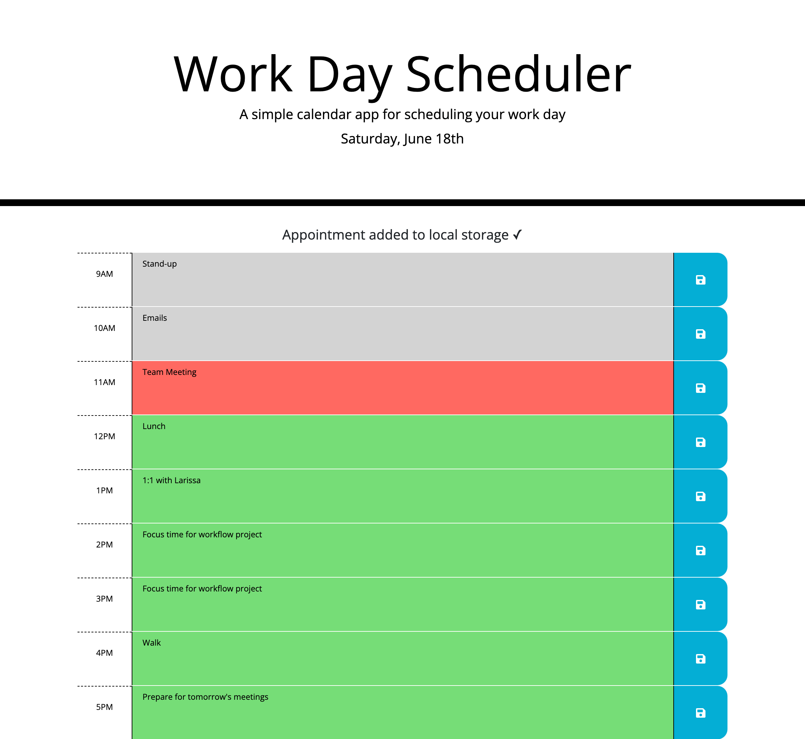

# work-day-scheduler

## Description

My goal for this project was to build a daily events planner. This allows the user to save events for each hour of the day, which could help them plan and manage their time more effectively.

To achieve this, I used HTML, CSS and Javascript.

During this project, I consolidated my understanding of Javascript and third-party APIs. In particular, I re-inforced what I have learnt about:
- Stylesheet and script tag ordering in HTML
- jQuery
- Bootstrap
- Moment().js
- And, DOM transversal.

## Access

To access the live application via Github Pages, click [here](https://hayleyarodgers.github.io/work-day-scheduler/). 

To access the repository where the code I refactored is saved, click [here](https://github.com/hayleyarodgers/work-day-scheduler).

## Credits

This is the [starter code](https://github.com/coding-boot-camp/super-disco) that I refactored from [Xandromus](https://github.com/Xandromus/Xandromus). I used modified versions on the HTML and CSS that had already been written in this starter code, and wrote my own Javascript.